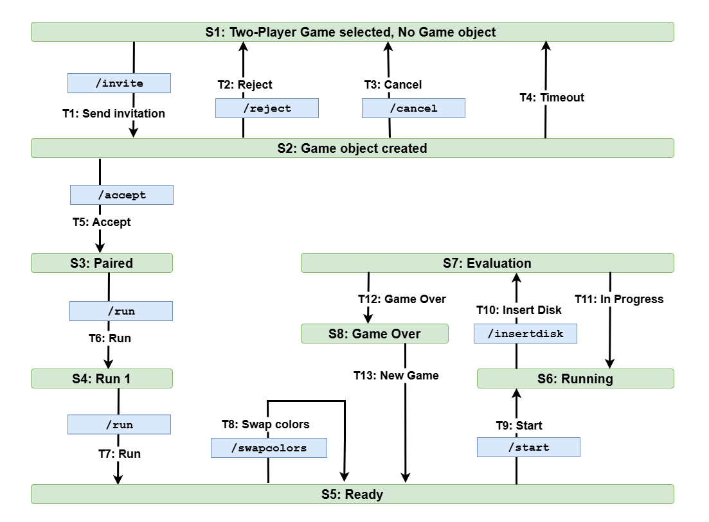

# Connect Four

## State Transition FSM

## Panel browser

### 1. /games/run

- Request: refreshToken
- Response: newRefreshToken, newAccessToken
  - Frontent 
    - Save to sessionStorage
    - Open new browser and pass tokens as parameters

## Game browser

- On mount parse tokens and save to sessionStorage

### 2. /games/init

- Request:   { gameId, userId} Auth Bearer: accessToken
- Response:  { gameId, id, userName, user2Id, user2Name}
  - Frontend save id as myID to sessionStorage

### 3. /websocket

### 4. /games/connect4/init

- Backend: updateUserActivity

### 5. /games/connect4/swapcolors

- Backend: updateUserActivity

### 6. /games/connect4/start

- Backend: updateUserActivity

### 7. /games/connect4/insertdisk

- Backend: updateUserActivity

### 8. /games/connect4/newgame

