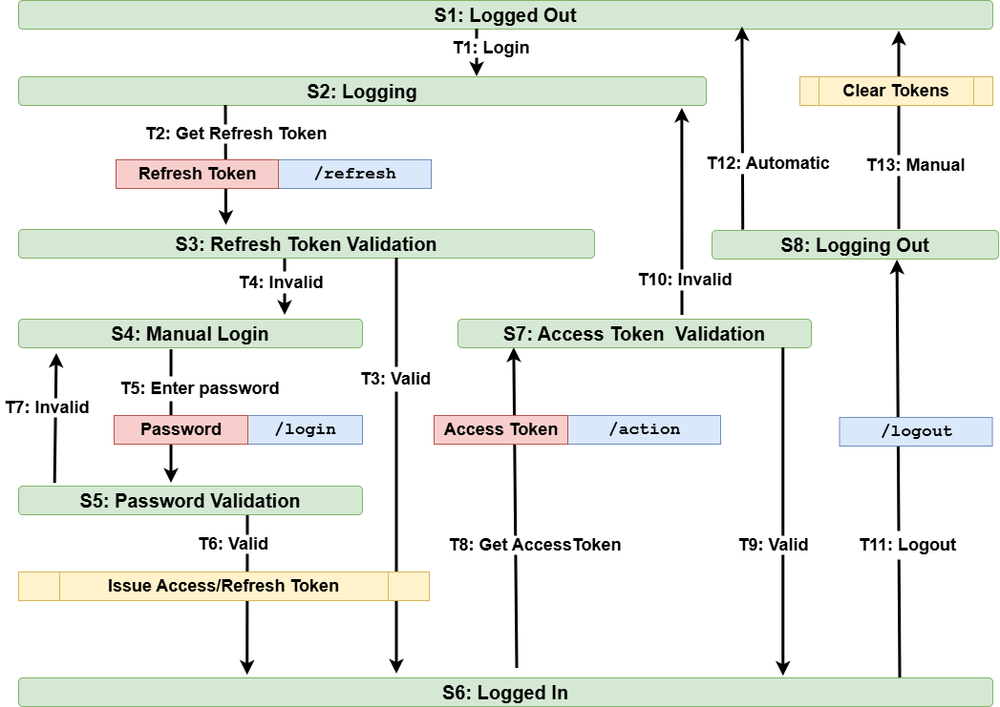

# Games - Full stack project in React, Java and MySql

<a href="https://gamesj.barryonweb.com">Run Project</a>  
<a href="https://github.com/berislav-vidakovic/GamesJ">View Code</a>


## Complete vertical

1. [Create Project skeleton](#1-create-project-skeleton)
2. [Add ping endpoint](#2-add-ping-endpoint)
3. [Create Nginx Config Template for Spring Boot Backend](#3-create-nginx-config-template-for-spring-boot-backend)
4. [Issue SSL Certificate with Certbot for gamesj. subdomain](#4-issue-ssl-certificate-with-certbot-for-gamesj-subdomain)
5. [Build backend, Deploy, install Java Runtime and Test](#5-build-backend-deploy-install-java-runtime-and-test)
6. [Register backend as service](#6-register-backend-as-service)
7. [Create CI/CD pipeline](#7-create-cicd-pipeline)
8. [Connect backend to DB](#8-connect-backend-to-db)
9. [Web socket and CORS policy to connect Frontend with backend](#9-web-socket-and-cors-policy-to-connect-frontend-with-backend)
10. [Hashing password and JWT authentication](#10-hashing-password-and-jwt-authentication)
11. [Refresh token and auto login/logout](#11-refresh-token-and-auto-loginlogout)
12. [Session monitor and idle cleanup](#12-session-monitor-and-idle-cleanup)


### 1. Create Project skeleton

1. Generate Spring Boot Project on  https://start.spring.io

    - Fill

      - Project	Maven
      - Language	Java
      - Group	com.gamesj
      - Artifact	gamesj
      - Name	gamesj
      - Packaging	Jar
      - Java	21

    - Add Dependencies (click Add Dependencies):

      - Spring Web (for REST API)
      - Spring WebSocket (for WebSocket support)
      - Spring Boot DevTools

2. Download, Extract and run

        mvn spring-boot:run

3. Git init, commit, push

### 2. Add ping endpoint

- Create Controllers/PingController.java

### 3. Create Nginx Config Template for Spring Boot Backend

- Create basic file /etc/nginx/sites-available/gamesj

    ```bash
    server {
      listen 80;
      server_name gamesj.barryonweb.com;

      location / {
          proxy_pass http://127.0.0.1:8080/;
          proxy_set_header Host $host;
          proxy_set_header X-Real-IP $remote_addr;
          proxy_set_header X-Forwarded-For $proxy_add_x_forwarded_for;
          proxy_set_header X-Forwarded-Proto $scheme;
      }

      # Health check endpoint
      location /ping {
          proxy_pass http://127.0.0.1:8080/api/ping;
          proxy_set_header Host $host;
          proxy_set_header X-Real-IP $remote_addr;
          proxy_set_header X-Forwarded-For $proxy_add_x_forwarded_for;
          proxy_set_header X-Forwarded-Proto $scheme;
      }
    }
    ```

- Activate, verify, reload

      sudo ln -s /etc/nginx/sites-available/gamesj /etc/nginx/sites-enabled/
      ls -l /etc/nginx/sites-enabled/
      sudo nginx -t
      sudo systemctl reload nginx

### 4. Issue SSL Certificate with Certbot for gamesj. subdomain

- Run Certbot with Nginx plugin

      sudo certbot --nginx -d gamesj.barryonweb.com

- After success, certificates are stored in:

      /etc/letsencrypt/live/gamesj.barryonweb.com/fullchain.pem
      /etc/letsencrypt/live/gamesj.barryonweb.com/privkey.pem

- Update last section in gamesj Nginx config file

  - Add HSTS line in SSL section - Force browsers to use HTTPS, even if the user tries HTTP

    ```bash
    add_header Strict-Transport-Security "max-age=31536000; includeSubDomains" always;
    ```

  - Update last section 

    ```bash
    # Redirect all HTTP requests to HTTPS
    server {
        listen 80;
        server_name gamesj.barryonweb.com;
        return 301 https://$host$request_uri;
    }
    ```

- Reload Nginx:

      sudo systemctl reload nginx


### 5. Build backend, Deploy, install Java Runtime and Test

- Create target/gamesj-0.0.1-SNAPSHOT.jar

      mvn clean package

- Copy jar file to server 

      scp target/gamesj-0.0.1-SNAPSHOT.jar barry75@barryonweb.com:/var/www/games/gamesj/

- Install Java runtime and verify

      wget https://github.com/adoptium/temurin21-binaries/releases/download/jdk-21.0.9+10/OpenJDK21U-jdk_x64_linux_hotspot_21.0.9_10.tar.gz
      sudo mkdir -p /usr/lib/jvm
      sudo tar -xzf OpenJDK21U-jdk_x64_linux_hotspot_21.0.9_10.tar.gz -C /usr/lib/jvm
      sudo update-alternatives --install /usr/bin/java java /usr/lib/jvm/jdk-21.0.9+10/bin/java 1
      sudo update-alternatives --install /usr/bin/javac javac /usr/lib/jvm/jdk-21.0.9+10/bin/javac 1
      sudo update-alternatives --config java
      sudo update-alternatives --config javac
      java --version
      javac --version

- Run backend manually

      java -jar /var/www/games/gamesj/gamesj-0.0.1-SNAPSHOT.jar


- Test in Terminal

      curl https://gamesj.barryonweb.com/ping

- Test in Browser 

      https://gamesj.barryonweb.com/ping


### 6. Register backend as service

  - Create service file in  /etc/systemd/system/gamesj.service

  - Reload systemd to register the service

        sudo systemctl daemon-reload

  - Start/stop the service 

        sudo systemctl start gamesj
        sudo systemctl stop gamesj

  - Check the status 

        sudo systemctl status gamesj

  - Enable automatic start on boot

        sudo systemctl enable gamesj

  - Enable no password to restart service

        sudo visudo 
        barry75 ALL=(ALL) NOPASSWD: /bin/systemctl restart gamesj
        barry75 ALL=(ALL) NOPASSWD: /bin/systemctl reload nginx
        barry75 ALL=(ALL) NOPASSWD: /bin/cp, /bin/ln, /usr/sbin/nginx

  - Check no password commands for the user

        sudo -l -U barry75


  - Follow logs in realtime

        sudo journalctl -u gamesj -f


### 7. Create CI/CD pipeline

- Create .github/workflows/deploy.yml

- Dev (Win): Create and update key pair 

      ssh-keygen -t ed25519 -C "github-ci" -f github_ci
  
  - copy keys to ~/.ssh/

- VPS (Linux): Add the Public key 

  - append github_ci.pub content to ~/.ssh/authorized_keys 

- Test connection Dev-VPS: 

      ssh -i ~/.ssh/github_ci barry75@barryonweb.com

- GitHub: Add the Private Key to GitHub Secrets

  - Repo: Settings - Secrets and variables - Actions - New repository secret
    - Paste full content of private key github_ci
  - (Optional TODO) Add Known Hosts Fingerprint

- Test connection GitHub-VPS

  - Create .github/workflows/test-ssh.yml

      ```yml
      name: Test SSH Connection
      on:
        workflow_dispatch:  # Allows trigger manually in GitHub
      jobs:
        test-ssh:
          runs-on: ubuntu-latest
          steps:
            - name: Checkout repository
              uses: actions/checkout@v4
            - name: Start SSH agent and load key
              uses: webfactory/ssh-agent@v0.9.0
              with:
                ssh-private-key: ${{ secrets.SSH_PRIVATE_KEY }}
            - name: Test SSH connection
              run: ssh -o StrictHostKeyChecking=no barry75@barryonweb.com "echo Connected successfully from GitHub!"
      ```

  - GitHub Actions - Run workflow


### 8. Connect backend to DB

- Add dependencies JPA and MySQL to pom.xml

- Configure datasource in src/main/resources/application.yaml

- Create Controller, Model, Repository


### 9. Web socket and CORS policy to connect Frontend with backend

- Add frontend dev and production URL to Config/CorsConfig.java

- Create Config/WebSocketConfig.java

- Create WebSockets/WebSocketHandler.java

- Add copy frontends to gamesj dir to frontend deploy yaml file 

- Add Websocket and Frontend sections to Nging config file gamesj 


### 10. Hashing password and JWT authentication

#### Workflow

1. Register
    - Request: send raw password
    - Backend applies hashing and stores hashed password into DB 
    - Response: acknowledgement 

2. Login
    - Request: send raw password
    - Backend compares matching password and stored hashed value
    - Response: JWT (JSON Web Token)
    - Frontend stores JWT into sessionStorage

3. Any action
    - Request: send JWT in header Authorization: Bearer 
    - Backend checks JWT if endpoint not in white list within JwtAuthFilter

4. Logout 
    - Request: send JWT in header Authorization: Bearer 
    - Response: acknowledgement 
    - Frontend clears JWT from sessionStorage


#### Implementation

- Add dependencies into pom.xml

- Create class SecurityConfig 

- Hashing password at user register using BCrypt 

    ```java
    String hashedPwd = passwordEncoder.encode(password);
    ```

- Validating password at user login

    ```java
    boolean passwordsMatch = passwordEncoder.matches(password, user.getPwd());
    ```

- Created class JwtUtil

  - SECRET_KEY, EXPIRATION_TIME_MS and generateToken

- Generate JWT and send it in API Response 

    ```java
    String token = JwtUtil.generateToken(user.getUserId(), user.getLogin());
    ```

- Frontend handles JWT with sessionStorage  

    - stores on login
    - removes on logout

- Include JWT in API Request Header

    ```ts
    "Authorization": "Bearer " + sessionStorage.getItem("authToken"),
    ```

- Apply JWT authentication check in backend - create filter class  JwtAuthFilter

  - define endpoints that skip authentication


### 11. Refresh token and auto login/logout

/api/users/login  
- API Request: { userId, password }
- API Response: { userId, isOnline = true, accessToken, refreshToken }
- WS Broadcast: { type: userSessionUpdate }

/api/users/refresh
- API Request: { refreshToken }
- API Response: { userId, isOnline = true, accessToken, refreshToken }
- WS Broadcast: { type: userSessionUpdate }

/api/users/logout
- Request: { userId }
- Response: { userId, isOnline = false }
- WS Broadcast: { type: userSessionUpdate }

/websocket
- Broadcast auto logout: { type: userSessionUpdate, data: { automaticLogout =true } }


### Login / Logout FSM — State Transitions



  

 <table border="1" cellspacing="0" cellpadding="6" style="border-collapse: collapse; width: 100%; text-align: left;">
  <thead>
    <tr>
      <th>#</th>
      <th>Start State</th>
      <th>Transition</th>
      <th>Next State</th>
    </tr>
  </thead>
  <tbody>
    <tr><td>1</td><td>S1 – Logged out</td><td>T1 – Browser Refresh</td><td>S2 – Browser Refresh</td></tr>
    <tr><td>2</td><td>S1 – Logged out</td><td>T2 – Manual Login</td><td>S3 – Auto Login</td></tr>
    <tr><td>3</td><td>S2 – Browser Refresh</td><td>T3 – Get Refresh Token</td><td>S4 – Refresh Token Validation</td></tr>
    <tr><td>4</td><td>S3 – Auto Login</td><td>T4 – Get Refresh Token</td><td>S4 – Refresh Token Validation</td></tr>
    <tr><td>5</td><td>S4 – Refresh Token Validation</td><td>T5 – Invalid</td><td>S5 – invalid Refresh Token</td></tr>
    <tr><td>6</td><td>S5 – invalid Refresh Token</td><td>T6 – Browser Refresh</td><td>S1 – Logged out</td></tr>
    <tr><td>7</td><td>S5 – invalid Refresh Token</td><td>T7 – Auto Login</td><td>S6 – UI Dialog Login</td></tr>
    <tr><td>8</td><td>S6 – UI Dialog Login</td><td>T8 – Enter Password</td><td>S7 – Password Validation</td></tr>
    <tr><td>9</td><td>S7 – Password Validation</td><td>T9 – Invalid</td><td>S6 – UI Dialog Login</td></tr>
    <tr><td>10</td><td>S7 – Password Validation</td><td>T10 – Valid</td><td>S8 – Renew Tokens</td></tr>
    <tr><td>11</td><td>S8 – Renew Tokens</td><td>T11 – Tokens renewed</td><td>S9 – Logged In</td></tr>
    <tr><td>12</td><td>S4 – Refresh Token Validation</td><td>T12 – Valid</td><td>S8 – Renew Tokens</td></tr>
    <tr><td>13</td><td>S9 – Logged In</td><td>T13 – Get Access Token</td><td>S10 – Access Token Validation</td></tr>
    <tr><td>14</td><td>S10 – Access Token Validation</td><td>T14 – Invalid</td><td>S3 – Auto Login</td></tr>
    <tr><td>15</td><td>S10 – Access Token Validation</td><td>T15 – Valid</td><td>S9 – Logged In</td></tr>
    <tr><td>16</td><td>S9 – Logged In</td><td>T16 – Manual Logout</td><td>S11 – Clear Tokens</td></tr>
    <tr><td>17</td><td>S11 – Clear Tokens</td><td>T17 – Tokens cleared</td><td>S1 – Logged out</td></tr>
    <tr><td>18</td><td>S9 – Logged In</td><td>T18 – Auto Logout</td><td>S1 – Logged out</td></tr>
  </tbody>
</table>


### 12. Session Monitor and idle cleanup

- Websocket connection
  - Established on mount
  - Closed on idle timeout or Browser close
  - Close/Reconnected on Browser Refresh

- Websocket Monitor
  - Collect sessions and users to remove
  - Remove users - Auto logout
  - Close sessions and remove from Map

#### Implementing Timer for cleanup Users

- When the 1st User connected Timer started
- Timer is running while there are connected users
- When the last User disconnected Timer stops

There is checklist for Timer implementation

  - using a ScheduledExecutorService
  - starting the timer only when needed
  - stopping the timer when the last user is removed
  - shutting down cleanly via @PreDestroy
  - avoiding race-conditions with synchronized
  - stopping only the repeating task (not the whole executor)


1. Define parameters in application.yaml:

    ```yaml
    useridle:
      timeout-mins: 2
      check-interval-sec: 60
    ```

2. Inject parameters from application.yaml to class member variables

    ```java
    @Value("${useridle.timeout-mins}")
    private short idleTimeoutMinutes;

    @Value("${useridle.check-interval-sec}")
    private short cleanupIntervalSeconds;
    ```

3. Add scheduler and task member variables

    ```java
    private final ScheduledExecutorService scheduler = Executors.newSingleThreadScheduledExecutor();
    private ScheduledFuture<?> cleanupTask;  // to control start/stop
    ```

4. Create stopTimer method

    ```java
    private synchronized void stopTimer() {
      if (cleanupTask != null && !cleanupTask.isCancelled()) 
          cleanupTask.cancel(false);
    }
    ```


5. Create cleanup method

    - check user timestamp if it is older than idleTimeoutMinutes 
    - stop Timer when last user removed 

    ```java
    public void cleanupIdleUsers() {
      try {
        LocalDateTime now = LocalDateTime.now();
        Duration idleTimeout = Duration.ofMinutes(idleTimeoutMinutes);
        userActivityMap.entrySet().removeIf(entry -> {
          boolean idle = Duration.between(entry.getValue().getTimeStamp(), now).compareTo(idleTimeout) > 0;
          if (idle) {
            int userId = entry.getKey();
            System.out.println(" *** Removing idle user: " + userId);
            autoLogout(userId);
          }
          return idle;
        });
        if( userActivityMap.isEmpty() ) // Stop timer if no active users remain
          stopTimer();
      } 
      catch (Exception e) {
        System.err.println("Fatal error in cleanupIdleUsers: " + e.getMessage());
        e.printStackTrace();
      }
    }
    ```

6. Create start Timer method

    - assign scheduler.scheduleAtFixedRate return value to cleanupTask
      - attach cleanup function 
      - set interval for its execution to cleanupIntervalSeconds

    ```java
    private synchronized  void startTimer(){
      if (cleanupTask != null && !cleanupTask.isCancelled() && !cleanupTask.isDone())
        return; // already running
      cleanupTask = scheduler.scheduleAtFixedRate(
        this::cleanupIdleUsers,
        cleanupIntervalSeconds,
        cleanupIntervalSeconds,
        TimeUnit.SECONDS
      );
      System.out.println(" *** Timer started " );
    }
    ```

7. Call startTimer when the first user added

    - Timer not started if cleanupTask not defined 

    ```java
    public void updateUserActivity(int userId, UUID clientId) {
      // add or update userId in map  
      userActivityMap.compute(userId, (key, existingClient) -> {
        if (existingClient == null) {
          return new Client(LocalDateTime.now(), clientId);
        } 
        else {
          existingClient.setTimeStamp();
          existingClient.setClientId(clientId);
          return existingClient;
        }
      });
      if (cleanupTask == null || cleanupTask.isCancelled() || cleanupTask.isDone()) 
        startTimer();
    }
    ```

8. Call stopTimer when the last user removed

    ```java
    public synchronized void removeUser(int userId) {
      if (userActivityMap.remove(userId) != null) {
        System.out.println(" *** User " + userId + " removed from UserMonitor");
        if (userActivityMap.isEmpty()) { // If no users remain → stop timer
          System.out.println(" *** LAST User (" + userId + ") removed from UserMonitor");
          stopTimer();
        }
      } 
      else 
        System.out.println(" *** removeUser: user " + userId + " not found in map");
    }
    ```

9. Create shutdown method to be  called when the Spring application is shutting down.

    ```java
    @PreDestroy
    public void shutdown() {
        scheduler.shutdown();
        System.out.println(" *** Scheduler SHUTDOWN");
    }
    ```


